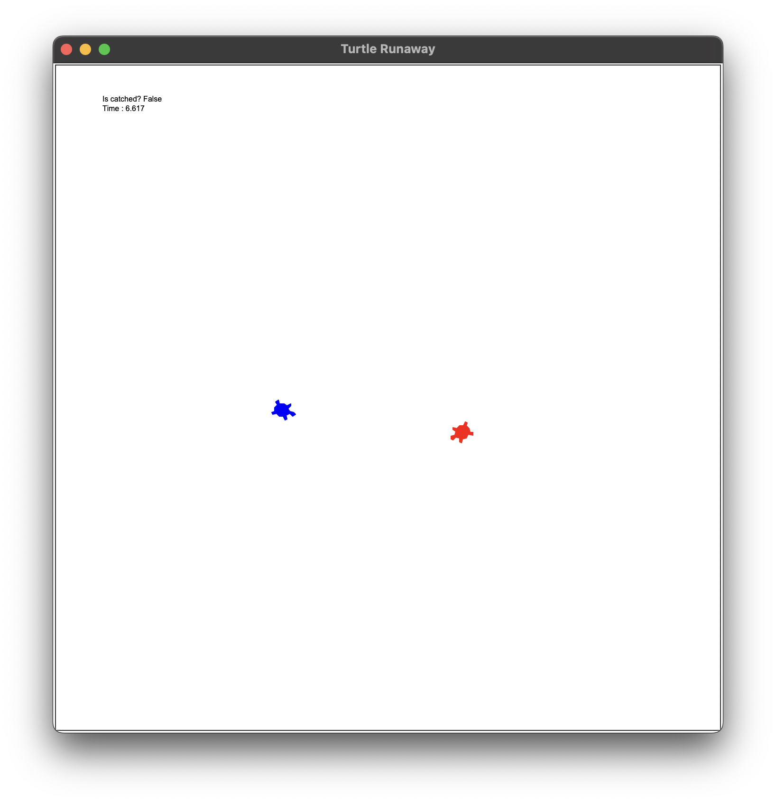
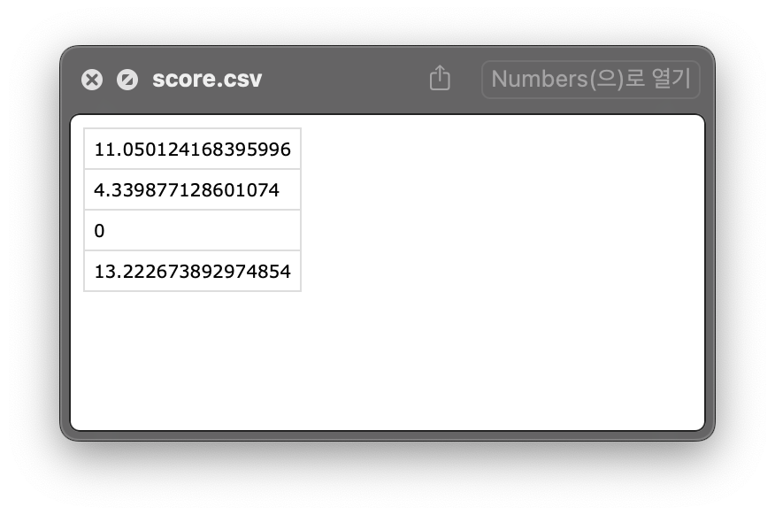

#Trutle Runaway

1. 타이머 추가
    - 게임 시작시와 게임이 끝났을 때의 시간을 기록 후 차이를 표시
    </img> 
2. Runner의 행동추가
    - runner의 위치가 화면을 벗어나면 게임오버로 인한 종료

3. 게임을 완료한 시점의 시간 기록(점수)
    - score.csv 파일에 게임 종료 시의 시간을 기록하여 점수를 확인
    </img> 
